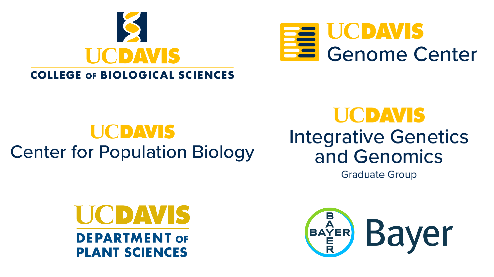

---
---

{:.logo}

Welcome to the site for the **25th Bay Area Population Genomics (#BAPGXXV) Conference** at UC Davis! The conference will be held **April 11, 2026** on UC Davis Campus at the [Genome and Biomedical Sciences Facility](https://maps.app.goo.gl/7QezoGmFrFkTKSvN9). Parking is free on campus on weekends and available directly outside the building. **Registration for talks is now closed, but registration for posters and attendance is still open.** Please follow the link below to the Google Form. Registration is free (but required) and will include coffee/breakfast and lunch for the first 150 people that register.

[REGISTER HERE](https://docs.google.com/forms/d/e/1FAIpQLSd3P79sb4HIIOKyH8xKJhyxv-iVvBXHRG0LN3auQgC7aZ1ggQ/viewform?usp=dialog)

Thank you to the UC Davis [College of Biological Sciences](https://biology.ucdavis.edu), [Genome Center](https://genomecenter.ucdavis.edu), [Center for Population Biology](https://cpb.ucdavis.edu), [Integrative Genetics and Genomics Graduate Group](https://igg.ucdavis.edu), [Department of Plant Sciences](https://www.plantsciences.ucdavis.edu), and [Bayer](https://www.bayer.com/) for sponsoring this conference!

{:.sponsor}

### Schedule

#### **8:30-9:25**: Check-in and continental breakfast 

#### **9:25-9:30**: Welcome Remarks

#### **9:30-10:30**: Talk Session 1 - Moderator:
* 9:30-9:45: **Turnover and introgression shape the dynamic evolution of a sexual mimicry polymorphism shared across the genus Xiphophorus** - Tristram Dodge, Schumer Lab, Stanford University
* 9:45-10:00: **Community coalescence reveals strong selection and coexistence within species in complex microbial communities** - Sophie Walton, Petrov and Good Labs, Stanford University
* 10:00-10:15: **No Evidence for MHC-Based Mate Choice: Insights from a Natural Experiment in the Himba** - Gillian Meeks, UC Davis
* 10:15-10:30: **Single-cell transcriptomics reveals early Wolbachia infection dynamics in Drosophila melanogaster** - Jodie Jacobs, Russell Lab, UC Santa Cruz

#### **10:30-11:10**: Coffee Break 

#### **11:10-12:10**: Talk Session 2 - Moderator:
* 11:10-11:25: **Population genomics of Ctenophores** - Shannon Johnson, Monterey Bay Aquarium Research Institute
* 11:25-11:40: **An assembly graph permutation test to detect variation caused by haplotype misassembly** - Sam Bogan, Kelley Lab, UC Santa Cruz
* 11:40-11:55: **The genetics, evolution, and maintenance of a biological rock-paper- scissors game** - Ammon Corl, Nielsen Lab, UC Berkeley
* 11:55-12:10: **Biobank-scale visualization and interactive exploration of ancestral recombination graphs with Lorax** - Pratik Katte, Corbett-Detig Lab, UC Santa Cruz

#### **12:10-1:30**: Lunch

#### **1:30-2:00**: Keynote Talk - Molly Schumer, Stanford University - Insertion of an invading retrovirus impacts a novel color trait in swordtail fish

#### **2:00-3:00**: Talk Session 3 - Moderator:
* 2:00-2:15: **Point cloud local ancestry inference (PCLAI): continuous coordinate-based ancestry along the genome** - Margarita Geleta, Ioannidis Lab, UC Berkeley
* 2:15-2:30: **Benchmarking ultima ug100 reads for museum ants** - Homère Alves Monteiro, California Academy of Sciences
* 2:30-2:45: **Uncovering the Dynamics of Population Structure Through Time Using Genome-Wide Genealogies** - Yun Deng, Pritchard Lab, Stanford University
* 2:45-3:00: **Linked selection drives allele frequency change in global evolution experiment** - Roberts Miles, Exposito-Alonso Lab, UC Berkeley

#### **3:00-4:30**: Poster session