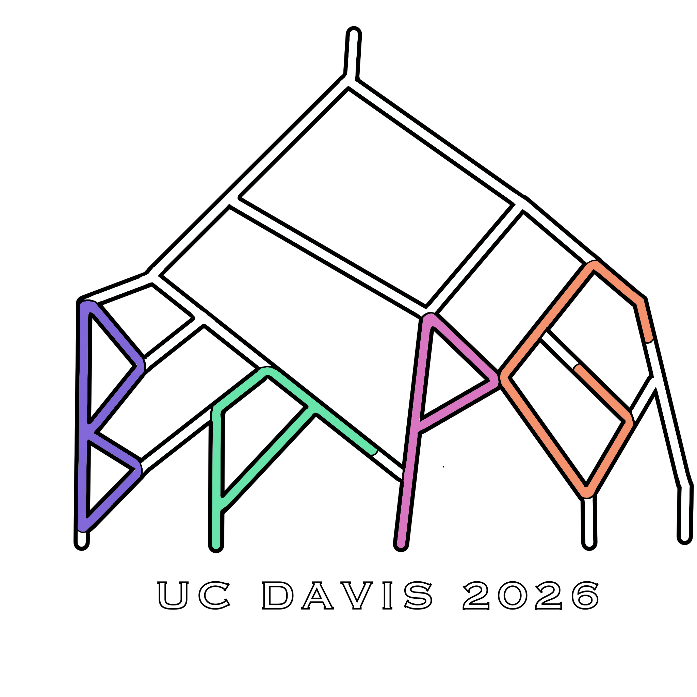
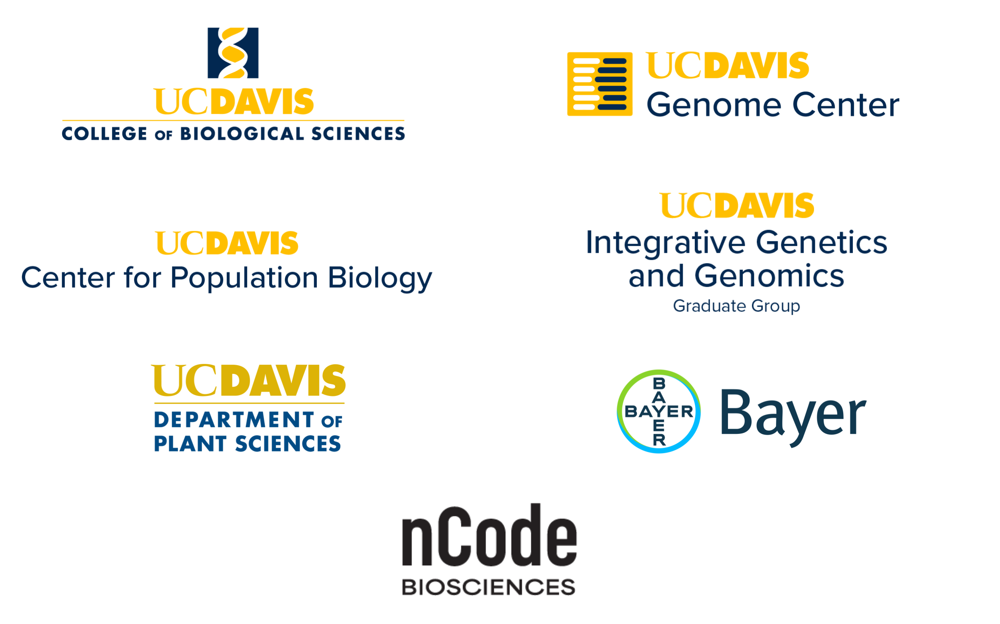

---
---

{:.logo}

Welcome to the site for the **25th Bay Area Population Genomics (#BAPGXXV) Conference** at UC Davis! The conference will be held **April 11, 2026** on UC Davis Campus at the [Genome and Biomedical Sciences Facility](https://maps.app.goo.gl/7QezoGmFrFkTKSvN9). Parking is free on campus on weekends and available directly outside the building. **Registration for talks is now closed, but registration for posters and attendance is still open.** Please follow the link below to the Google Form. Registration is free (but required) and will include coffee/breakfast and lunch for the first 150 people that register.

[REGISTER HERE](https://docs.google.com/forms/d/e/1FAIpQLSd3P79sb4HIIOKyH8xKJhyxv-iVvBXHRG0LN3auQgC7aZ1ggQ/viewform?usp=dialog)

Thank you to the UC Davis [College of Biological Sciences](https://biology.ucdavis.edu), [Genome Center](https://genomecenter.ucdavis.edu), [Center for Population Biology](https://cpb.ucdavis.edu), [Integrative Genetics and Genomics Graduate Group](https://igg.ucdavis.edu), [Department of Plant Sciences](https://www.plantsciences.ucdavis.edu), [Bayer](https://www.bayer.com/), and [nCode Biosciences](https://ncodebio.ai) for sponsoring this conference!

{:.sponsor}

### Schedule

#### **8:30-9:25**: Check-in and continental breakfast 

#### **9:25-9:30**: Welcome Remarks

#### **9:30-10:30**: Talk Session 1 - Moderator: Natasha Dhamrait
* 9:30-9:45: **Turnover and introgression shape the dynamic evolution of a sexual mimicry polymorphism shared across the genus Xiphophorus** - Tristram Dodge, Schumer Lab, Stanford University
* 9:45-10:00: **Community coalescence reveals strong selection and coexistence within species in complex microbial communities** - Sophie Walton, Petrov and Good Labs, Stanford University
* 10:00-10:15: **No Evidence for MHC-Based Mate Choice: Insights from a Natural Experiment in the Himba** - Gillian Meeks, Henn Lab, UC Davis
* 10:15-10:30: **Methylation Clocks Do Not Predict Age or Alzheimer's Disease Risk Across Genetically Admixed Individuals** - Sebastián Cruz-González, Capra Lab, UC San Francisco

#### **10:30-11:10**: Coffee Break 

#### **11:10-12:10**: Talk Session 2 - Moderator: Forrest Li
* 11:10-11:25: **Population genomics of Ctenophores** - Shannon Johnson, Monterey Bay Aquarium Research Institute
* 11:25-11:40: **An assembly graph permutation test to detect variation caused by haplotype misassembly** - Sam Bogan, Kelley Lab, UC Santa Cruz
* 11:40-11:55: **The genetics, evolution, and maintenance of a biological rock-paper- scissors game** - Ammon Corl, Nielsen Lab, UC Berkeley
* 11:55-12:10: **Biobank-scale visualization and interactive exploration of ancestral recombination graphs with Lorax** - Pratik Katte, Corbett-Detig Lab, UC Santa Cruz

#### **12:10-1:30**: Lunch

#### **1:30-2:00**: Keynote Talk - Molly Schumer, Stanford University - Insertion of an invading retrovirus impacts a novel color trait in swordtail fish

#### **2:00-3:00**: Talk Session 3 - Moderator: Regina Fairbanks
* 2:00-2:15: **Point cloud local ancestry inference (PCLAI): continuous coordinate-based ancestry along the genome** - Margarita Geleta, Ioannidis Lab, UC Berkeley
* 2:15-2:30: **Comparative multi-omics uncovers cis-driven rewiring of biofilm regulatory network topology across Candida species** - Deepika Gunasekaran, Nobile Lab, UC Merced
* 2:30-2:45: **Uncovering the Dynamics of Population Structure Through Time Using Genome-Wide Genealogies** - Yun Deng, Pritchard Lab, Stanford University
* 2:45-3:00: **Linked selection drives allele frequency change in global evolution experiment** - Roberts Miles, Exposito-Alonso Lab, UC Berkeley

#### **3:00-4:30**: Poster session
* **Immunogenetic Profiling of Tuberculosis Susceptibility in a South African Population** - Oshiomah Oyageshio, Henn Lab, UC Davis
* **Waves-on-plates': high-resolution lineage tracking in controlled range expansions** - Keon Abedi, Hallatschek Lab, UC Berkeley
* **Evolution in spatially structured populations** - Gursachi Sikka, Hallatschek Lab, UC Berkeley
* **Modeling Drug Resistance Evolution Via Ontogenetic Systems** - Zoe Keenan, Hallatschek Lab, UC Berkeley
* **Towards population genomics of the bacterial wilt pathogens in the Ralstonia solanacearum species complex** - Tiffany Lowe-Power, Lowe-Power Lab, UC Davis
* **Quantifying Anthropogenic Effects on Maize Genetic Diversity** - Samantha Snodgrass, Ross-Ibarra and Coop Labs, UC Davis
* **Genotype specific transcriptomic responses to heat stress in Zostera marina** - Glyn Carson, Bay Lab, UC Davis
* **One Nation Under a Groove: Ensemble Learning for Demographic Inference** - Ananya Kapoor, Kern-Ralph Colab, University of Oregon
* **HLA–KIR Interaction and Active Tuberculosis Risk in Khoe-San Descent Populations** - Kristin Hardy, Henn Lab, UC Davis
* **Catostomid genetics** - Johnathan Lo, Sudmant and Boots Labs, UC Berkeley
* **Tissue Specific Mitochondrial DNA Mutational Landscapes in Humans, Mice, and Macaques** - Hannah Aguilar, UC Berkeley
* **T2T primate genomes reveal 70 million years of structural  variation and karyotype evolution** - Scott Ferguson, Sudmant Lab, UC Berkeley
* **Expected Value of the Sackin index under a biased speciation model** - Daniel Bauman, Rosenberg and Good Lab, Stanford University
* **TBD** - Japneet Kaur, Henn Lab, UC Davis
* **Genomic diversity across 200 plant species of variable Red List status** - Jules Perez, Moi Lab, UC Berkeley
* **Experimental climate change magnifies genetic vulnerabilities from mutation load and maladaptation** - Laura Leventhal, Stanford University
* **Spatial Genomic Scale and Determinants of Human Germline Mutation Landscape** - Nathan Cramer, Moorjani Lab, UC Berkeley
* **Maize landraces are not distinct populations or genetic lineages** - Mackenzie Chun, Ross-Ibarra Lab, UC Davis
* **Measuring selection on regulatory networks combining population transcriptomics and experimental evolution** - Eddy Mendoza-Galindo, UC Berkeley
* **What the POP is going on? Complex allelic variation underlying trait diversification in columbines** - Evangeline Ballerini, Ballerini Lab, CSU Sacramento
* **Determinants of local ancestry in a three species hybrid zone** - Kelsie Hunnicutt, Schumer Lab, Stanford University
* **Population genetic determinants of protein biophysics** - Solomon McShea, Phillips Lab, UC San Francisco
* **The contribution of ethnolinguistics to Mesoamerican maize genetic diversity** - Forrest Li, Ross-Ibarra Lab, UC Davis
* **CAAPAWeb: Linking Data and Discovery for Population Genomics and Variant Annotation** - Mustafa Malik, Henn Lab, UC Davis
* **Panmap: Scalable phylogeny-guided alignment, genotyping, and placement on pangenomes** - Alan Zhang, Corbett-Detig Lab, UC Santa Cruz
* **Seasonally fluctuating selection drives repeatable allele frequency shifts across years in large genetically diverse populations** - Christopher Kirby, Petrov Lab, Stanford University
* **Comparative genomic analyses shed light on the introduction routes of rice-pathogenic Burkholderia gladioli strains into Bangladesh** - Ismam Ahmed Protic, Alvarez-Ponce Lab, University of Nevada Reno
* **Infrastructure for Genomics Analysis at Scale** - Syrine Ben Driss, Operon Technologies
* **The Genomic Legacy of Neanderthal and Denisovan Ancestry Across 50,000 Years of Evolutionary History in East Asia** - Sophie Joseph, Moorjani Lab, UC Berkeley
* **Reconstructing mutation patterns over the course of human evolution** - Yulin Zhang, Moorjani Lab, UC Berkeley
* **Towards Defining a Core Mouse Gut Microbiome** - Cassandra Olivas, Data Intensive Biology Lab, UC Davis